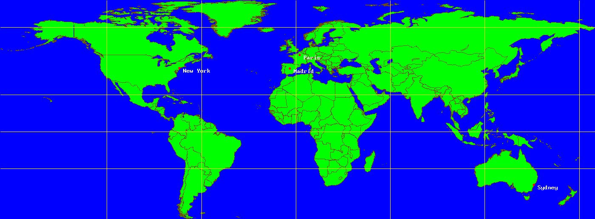
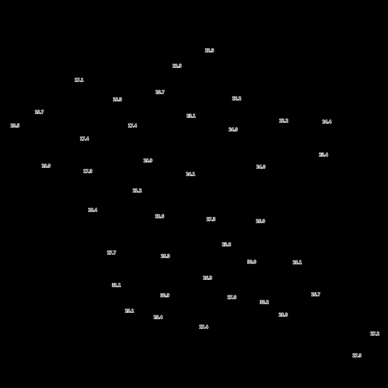

# Cartograph

A library, and command line tools, to play with geographic data.

This project is still experimental.

## Dependencies

This project use

 * [yder](https://github.com/babelouest/yder) as logger module.
 * [yImage](https://github.com/thaddeus002/yImage) for drawing and image superposition.

Theses dependencies are include in the projet as git submodules. So, use the following command to clone the repository, and have all the needed code :

```shell
$ git clone --recurse-submodules https://github.com/thaddeus002/cartograph.git
```

## Examples

### BLN data representation

BLN file format is a simple text format to represent curves (countries' boundaries, coast, roads, rivers, ...) as a succesion of points. Drawing lines between the points make the curve's trace. One or more curves can be present in one file. A curve is one header on a file line containing the number (n) of points, and optionnaly the name of the curve separate from n by a comma. The header is followed by n lines containing the points coordinates separated by commas. The coordinates may be (X,Y) for Lambert projection, or more often (lon, lat).

For example, the file [world.bln](data/world.bln) contains world's countries ' boundaries with a pretty good resolution.

The program `trace` can make a map from bln data. It's built by the command :

```shell
$ make -C src trace
```

Then we can use it to create a graphic representation of the data of file world.bln, and also plot some cities from file [cities.csv](data/cities.csv).



This map was made by the command :

```shell
$ src/trace data/world.bln data/cities.csv
```

The first argument is the filename for bln data and the second, which is optional, is the name of a csv file containing points to plot on the map.

### Use bln for image background (program draw_background.c)

For this example, data layer is provide as a png image by a WMS server. The temperatures are placed on an image with a black background.

To localize the data we need a background image with at least countries boundaries. We have this boundaries in file [europe.bln](data/europe.bln).

data source : [Météo France](https://donneespubliques.meteofrance.fr/?fond=geoservices&id_dossier=14)

[geoservices' documentation (in french)](https://donneespubliques.meteofrance.fr/client/gfx/utilisateur/File/documentation-webservices-inspire.pdf)

The raw image is :



The program output shows the same data with a better background :


