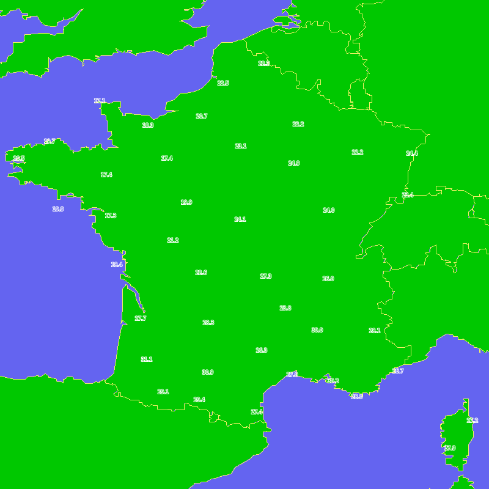

# Cartograph
Command line tools to play with geographic data.

This project is still experimental.

##Examples

###Use bln for image background

For this example, data layer is provide as a png image by a WMS server. The temperatures are placed on an image with a black background.

To localize the data we need a background image with at least countries boundaries. We have this boundaries in file [europe.bln](data/europe.bln).

data source : [Météo France](https://donneespubliques.meteofrance.fr/?fond=geoservices&id_dossier=14)

[geoservices' documentation (in french)](https://donneespubliques.meteofrance.fr/client/gfx/utilisateur/File/documentation-webservices-inspire.pdf)

The raw image is :

The same with a better background :

 

